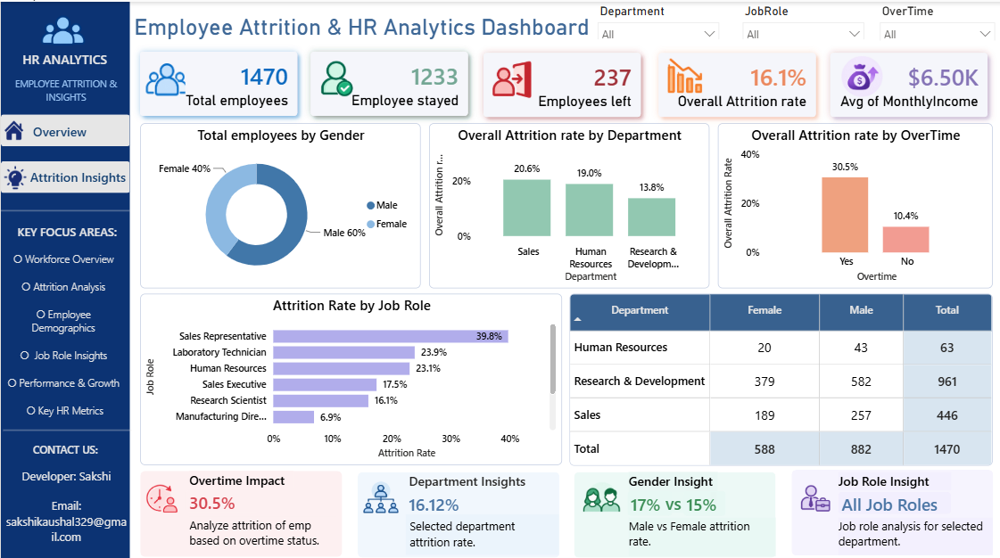
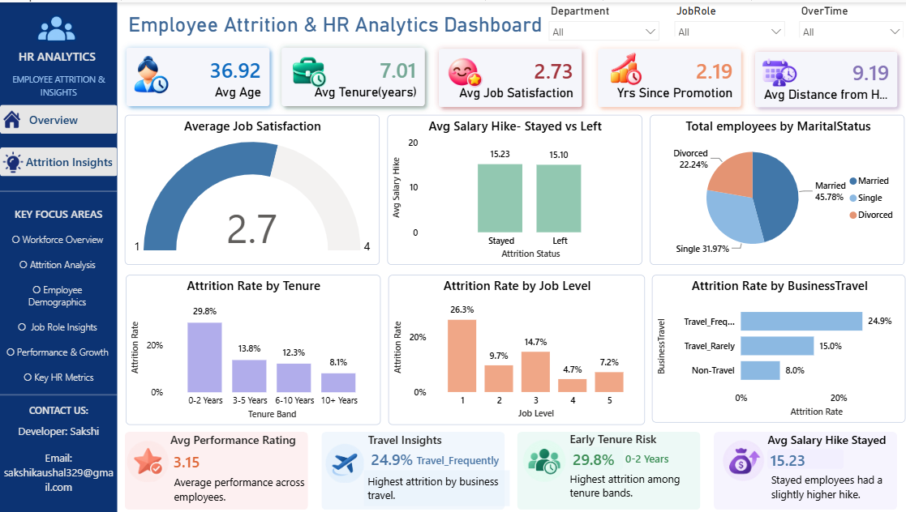

<div align="center">

# 📊 Employee Attrition & HR Analytics

### *Why do employees leave, and what can HR do about it?*

An end-to-end analytics project: **MySQL** for deep-dive analysis and **Power BI** for an interactive executive dashboard.


</div>

---

## 🚨 The Headline

> **1 in 6 employees leaves, and employees working overtime are almost 3x more likely to go.**

| 👥 Employees | ✅ Stayed | 🚪 Left | 📉 Attrition Rate | ⏱️ Overtime Attrition |
|:---:|:---:|:---:|:---:|:---:|
| **1,470** | **1,233** | **237** | **16.1%** | **30.5%** vs 10.4% |

---

## 🧾 In Plain English

Companies lose money and talent when employees quit. This project studies data on
**1,470 employees** to answer a simple question: **who leaves, and why?**

- About **1 in 6 employees** left the company.
- People working **overtime** left far more often (30.5%) than those who didn't (10.4%).
- **Sales** had the highest exit rate of any department.
- **New joiners** (first two years) were the most likely to leave.

These findings are turned into an interactive dashboard and practical suggestions HR teams can use to retain their people.

---

## 🎯 Business Problem

Attrition is costly: lost expertise, rehiring and onboarding expenses, and lower team morale. This project helps HR leadership answer:

- 📍 **Where** is attrition highest: department, role, age group, tenure band?
- 🔍 **Why** are people leaving: overtime, travel, commute, pay, promotions, satisfaction?
- 🛠️ **What** should HR do first to retain talent?

---

## 🖥️ Dashboard Preview

### Page 1: Workforce Overview
*Headcount, attrition KPIs, department, overtime, gender and job role breakdowns.*



### Page 2: Attrition Insights
*Satisfaction, salary hikes, tenure, business travel, marital status and job level analysis.*



**Interactive filters:** Department · Job Role · OverTime

---

## 💡 Key Insights

| # | Finding | Evidence |
|:-:|---|---|
| 1 | **Overtime is the #1 attrition driver** | 30.5% attrition with overtime vs 10.4% without |
| 2 | **Sales is the highest-risk department** | Sales 20.6% · HR 19.0% · R&D 13.8% |
| 3 | **Frequent travel pushes people out** | 24.9% (frequent) vs 15.0% (rarely) vs 8.0% (non-travel) |
| 4 | **The first two years are the danger zone** | 29.8% attrition for 0-2 years at company vs 8.1% beyond 10 years |
| 5 | **Sales Representatives are the highest-risk role** | 39.8% attrition, followed by Laboratory Technicians (23.9%) |
| 6 | **Slight gender gap** | Male 17.0% vs Female 14.8% |

---

## ✅ Recommendations

| Priority | Action | Why |
|:-:|---|---|
| 🔴 High | Rebalance workloads and cap overtime, starting with Sales | Overtime nearly triples attrition |
| 🔴 High | Build a structured 0-2 year onboarding and mentoring programme | Highest-risk tenure band |
| 🟠 Medium | Review career paths and pay for Sales Representatives | Highest-attrition role at 39.8% |
| 🟠 Medium | Offer travel rotation, remote options or allowances | Frequent travellers leave at 3x the rate of non-travellers |
| 🟡 Planned | Run targeted retention plans for Sales and HR | Both sit above the company average |

---

## 🧮 SQL Analysis

The SQL script (`sql/hr_attrition_analysis.sql`) is organised into four sections.

<details>
<summary><b>1️⃣ Data Exploration & Quality Checks</b></summary>

- Table preview, data types and row count
- NULL checks on key columns
- Duplicate check on `EmployeeNumber`
- Outlier and sanity checks (age, income, tenure vs age)
- Validation of categorical values

</details>

<details>
<summary><b>2️⃣ Headline Metrics</b></summary>

- Total employees, stayed vs left
- Overall attrition rate
- Average age and tenure

</details>

<details>
<summary><b>3️⃣ Segmentation</b></summary>

- Headcount by department and gender; average income by department
- Attrition by department, job role × age group, overtime, job satisfaction, distance from home and tenure band
- Salary hike and promotion gap: stayed vs left

</details>

<details>
<summary><b>4️⃣ Ranking & Advanced Analysis</b></summary>

- Department ranking with `RANK()`
- Departments above the overall attrition rate (CTEs + `CROSS JOIN`)
- Top 3 job roles with `DENSE_RANK()`
- Employees paid above their department average (CTE + `JOIN`)

</details>

**Skills demonstrated:** `CASE WHEN` · `GROUP BY / HAVING` · CTEs · Window Functions · Joins · Data Bucketing · Data Quality Validation

---

## 🗂️ Repository Structure

```
hr-attrition-analysis-sql-powerbi/
├── 📄 README.md
├── 📄 LICENSE
├── 📁 sql/
│   └── hr_attrition_analysis.sql
├── 📁 data/
│   └── hr_employee_attrition_cleaned.csv
└── 📁 dashboard/
    ├── hr_attrition_dashboard.pbix
    └── screenshots/
        ├── workforce_overview.png
        └── attrition_insights.png
```

## ⚙️ How to Run

1. Create the database: `CREATE DATABASE hr;`
2. Import `data/hr_employee_attrition_cleaned.csv` into a table named `hr_analytics`
3. Run `sql/hr_attrition_analysis.sql` section by section
4. Open `dashboard/hr_attrition_dashboard.pbix` in Power BI Desktop and refresh the data source

## 📖 Dataset

- **Source:** IBM HR Analytics Employee Attrition dataset (fictional, for educational use)
- **File:** `data/hr_employee_attrition_cleaned.csv`, the cleaned version (1,470 rows, 31 columns, no missing values)
- **Derived fields:** `AgeGroup`, `TenureBand`
- `JobSatisfaction`: 1 = Low · 2 = Medium · 3 = High · 4 = Very High

---

## ⚖️ Copyright & Intellectual Property Notice

**© 2026 Sakshi. All Rights Reserved.**

The SQL scripts, analytical methodology, dashboard design, layout, visualisations, DAX measures and written content in this repository are the original work and exclusive intellectual property of **Sakshi**.

No part of this work may be reproduced, copied, modified, adapted, distributed, published, or used to create derivative works, in whole or in part, for any commercial or non-commercial purpose, without the prior written consent of the author. Any unauthorised use may result in appropriate legal action under applicable copyright and intellectual property laws.

This repository is made publicly viewable for portfolio and evaluation purposes only; such visibility does not grant any licence or right of use. The underlying dataset is the property of its respective owner (IBM) and is not claimed by the author.

For permissions or collaboration enquiries, please contact the author below.

---

<div align="center">

## 👩‍💻 Author

**Sakshi**
📧 sakshikaushal329@gmail.com
🔗 [LinkedIn](https://www.linkedin.com/in/er-sakshi/) · 💻 [GitHub](https://github.com/sakshi-k07/)

⭐ *If you found this project informative, feel free to star the repository.*

</div>
